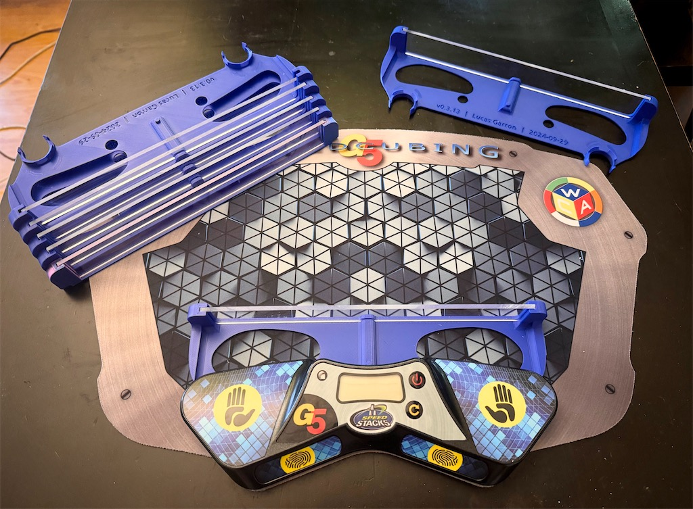
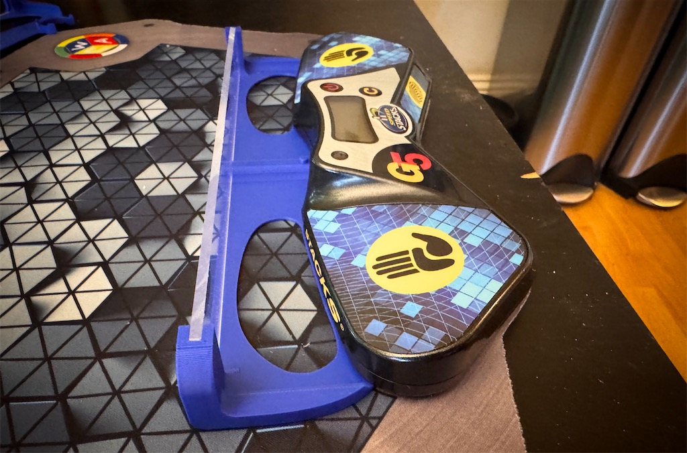
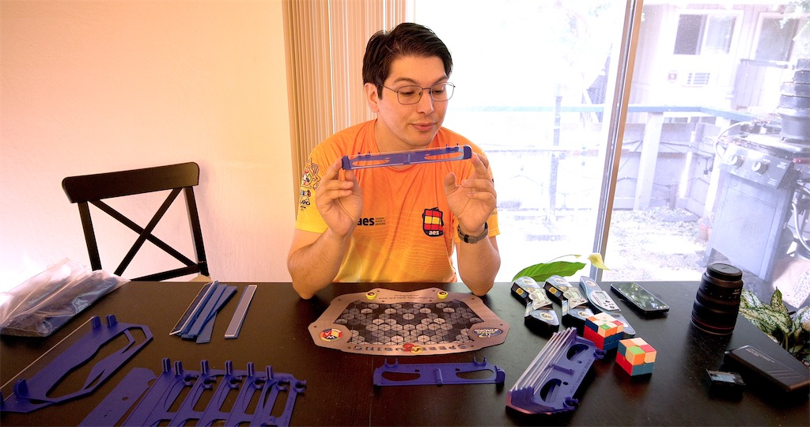

# Slide guard for speedcubing timers

An inexpensive slide guard for speedcubing timers. The current prototype is compatible with SpeedStacks G5 mats and timers.

The full prototype consists of:

| Item | Size | Material cost |
| - | - | - |
| Clear acrylic | 9in × 1in × ⅛in | ≤ $1 |
| Mounting bracket | 250mm × 77.1mm × 27.1mm | ≤ $1 |

The acrylic height can also vary in height (i.e. the 1in dimension can be shorter or longer).

I personally get my acrylic from [TAP Plastics](https://tapplastics.com/).

The design for the mounting bracket is in this repo. It can be 3D-printed in a consumer 3D printer, and is also designed so that it can be injection moulded in a single shot.

## Future improvements

- Improve 3D printing time (currently 45 minutes).
- Add stacking pins to the side ledges.
- Adjust the acrylic position (or replace with two separate angled pieces) to make it easier to place the puzzle on the mat at the end of the attempt.

## Files

This repo includes:

- Source files: SVG and [OpenSCAD](https://openscad.org/).
- STL: a rendered export from OpenSCAD. Units are millimeters.
- `.3mf` files: files from [Bambu Studio](https://bambulab.com/en/download/studio) ready to print.

## Video demo

<a href="https://www.youtube.com/watch?v=npT4VVcEYHo">https://www.youtube.com/watch?v=npT4VVcEYHo </a>

## License

This work is licensed under the Creative Commons Attribution-ShareAlike 4.0 license ([CC-By-SA 4.0](https://creativecommons.org/licenses/by-sa/4.0/deed.en)).
